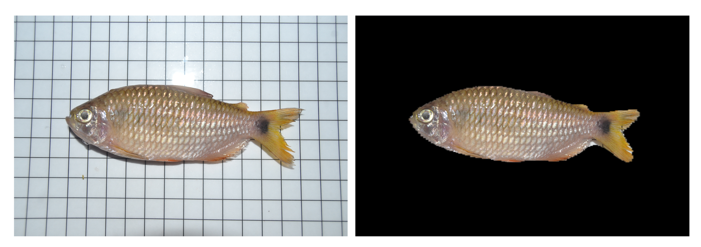

# Amazonian Fish ML Classifier

Robillard, A., Trizna, M. G., Ruiz-Tafur, K., Panduro, E. D., de Santana, C. D., White, A. E., Dikow, R. B., Deichmann, J. 2023. Application of a Deep Learning Image Classifier for Identification of Amazonian Fishes. *Ecology and Evolution* [DOI](https://doi.org/10.1002/ece3.9987)

Try our masking and fish classification models in a StreamLit application [here.](https://share.streamlit.io/miketrizna/streamlit_fish_masking/main/fish_masking_classification_streamlit.py)

Data from this paper are available on [figshare](https://doi.org/10.25573/data.c.5761097).

Code for StreamLit application is on [GitHub.](https://github.com/MikeTrizna/streamlit_fish_masking)

  

